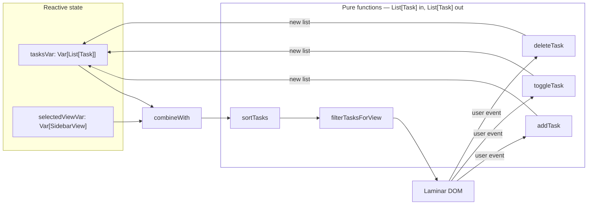

<h1 align="center">Functional Task Manager</h1>

<p align="center">
  A browser task planner written in Scala 3 and compiled to JavaScript —<br>
  immutable state, pure transformations, and a UI that is a function of a reactive signal.
</p>

<p align="center">
  
  
  
  
  
  <a href="https://github.com/VishnujanNarayanan/task_manager_using_functional_programming/actions/workflows/ci.yml"></a>
  
  
  <br>
  <a href="https://task-manager-using-functional-progr.vercel.app/"></a>
  <br>
  <a href="https://github.com/VishnujanNarayanan"></a>
  <a href="https://www.linkedin.com/in/vishnujan-narayanan"></a>
  <a href="https://substack.com/@vishnujannarayanan"></a>
</p>

<p align="center">
  🎯 <a href="#why-this-project-exists">Why</a> ·
  🧮 <a href="#-functional-programming-usage">FP Usage</a> ·
  🧩 <a href="#architecture">Architecture</a> ·
  ✨ <a href="#-features">Features</a> ·
  ⚡ <a href="#installation">Installation</a> ·
  🚀 <a href="#-deployment-vercel">Deployment</a> ·
  ⚠️ <a href="#limitations">Limitations</a>
</p>

---

## Why this project exists

Functional programming is usually demonstrated on problems that are already pure — sorting,
parsing, folding a list. A user interface is the awkward case: it is stateful by nature, and the
DOM is one large mutable object.

This project takes that case head on. The entire application is a `List[Task]` in a reactive
variable, a handful of pure functions that map one list to another, and a UI expressed as a
transformation of that signal. Nothing mutates a task, and no code touches the DOM directly. It
runs in a browser because Scala 3 compiles to JavaScript through Scala.js.

The sections below are the point of the repository: each functional-programming concept is shown
against the actual code that uses it.

---

## 🛠 Functional Programming Usage

This project strictly adheres to functional programming principles to manage state and business logic in a robust, predictable manner. The core architecture relies on unidirectional data flow, separating pure state transformations from UI rendering. Below are detailed examples of how these concepts are applied throughout the codebase.

### 1. Immutability & Case Classes
The application state is entirely modeled using immutable `case class` structures. There is no in-place mutation of data. When a user interacts with the application, a completely new copy of the data structure is created. 

This ensures data consistency and prevents unintended side-effects, making the system incredibly easy to reason about.

```scala
// Immutable Data Models representing the domain
case class TaskDate(year: Int, month: Int, day: Int) {
  def toDisplayString: String = s"$day/${month + 1}/$year"
  def toIsoString: String = f"$year%04d-${month + 1}%02d-$day%02d"
}

case class TaskTime(hour: Int, minute: Int) {
  def toDisplayString: String = f"$hour%02d:$minute%02d"
}

enum Priority:
  case High, Medium, Low

case class Task(
  id: Int, 
  title: String, 
  date: TaskDate, 
  time: TaskTime, 
  priority: Priority, 
  completed: Boolean
)
```

### 2. Pure Functions & State Transformations
All core business logic is encapsulated in pure functions. A pure function always produces the same output for the same input and has no side effects (it doesn't modify external variables).

Functions such as `addTask`, `toggleTask`, and `deleteTask` take the current state (a `List[Task]`) and explicit parameters as input, returning a brand new, transformed state.

```scala
// --- Pure Functions (State Transformations) ---

// Returns a new list with the new task appended, leaving the old list intact
def addTask(tasks: List[Task], title: String, date: TaskDate, time: TaskTime, priority: Priority, id: Int): List[Task] =
  tasks :+ Task(id, title.trim, date, time, priority, completed = false)

// Returns a new list where the specific task's 'completed' status is flipped using .copy()
def toggleTask(tasks: List[Task], id: Int): List[Task] =
  tasks.map(t => if (t.id == id) t.copy(completed = !t.completed) else t)

// Returns a new list excluding the deleted task
def deleteTask(tasks: List[Task], id: Int): List[Task] =
  tasks.filterNot(_.id == id)
```

### 3. Higher-Order Functions
The project extensively leverages Scala's rich collections API and higher-order functions (functions that take other functions as parameters) to manipulate task lists dynamically without loops.

*   **`map`**: Used to transform the list of tasks, such as when updating a task's status, and to reactively project state signals to UI elements.
*   **`filter` / `filterNot`**: Employed to derive specific views, such as identifying completed tasks or filtering by priority levels.
*   **`sortBy`**: Applies chronological ordering to tasks based on a tuple of nested date and time properties.

```scala
// Sorting chronologically using a higher-order function (sortBy) and a tuple
def sortTasks(tasks: List[Task]): List[Task] =
  tasks.sortBy(t => (t.date.year, t.date.month, t.date.day, t.time.hour, t.time.minute))
```

### 4. Pattern Matching
Pattern matching is used to type-safely handle the algebraic data types (ADTs) representing the application's views. It allows for exhaustive, compiler-checked logic branching without using brittle `if-else` chains.

For example, the `SidebarView` enum is pattern-matched within `filterTasksForView` to deterministically apply the correct filtering logic for each section:

```scala
enum SidebarView:
  case Tasks, Pending, Completed, HighPriority, MediumPriority, LowPriority

// Pure function using pattern matching to determine which tasks to display
def filterTasksForView(tasks: List[Task], view: SidebarView): List[Task] = {
  val sorted = sortTasks(tasks)
  view match {
    case SidebarView.Tasks | SidebarView.Pending => sorted.filter(!_.completed)
    case SidebarView.Completed => sorted.filter(_.completed)
    case SidebarView.HighPriority => sorted.filter(t => !t.completed && t.priority == Priority.High)
    case SidebarView.MediumPriority => sorted.filter(t => !t.completed && t.priority == Priority.Medium)
    case SidebarView.LowPriority => sorted.filter(t => !t.completed && t.priority == Priority.Low)
  }
}
```

### 5. Functional Reactive Programming (FRP) with Laminar
The user interface is entirely driven by reactive streams (`Var` and `Signal` from Laminar). State is separated from the UI; the UI simply *subscribes* to changes in the state and re-renders automatically using functional transformations (like `.map`).

```scala
// Reactive State Declarations
private val tasksVar = Var(List( /* initial tasks */ ))
private val selectedViewVar = Var(SidebarView.Tasks)

// ... Inside the UI rendering ...
// The UI functionally reacts to changes in tasksVar and selectedViewVar
children <-- tasksVar.signal.combineWith(selectedViewVar.signal).map { case (tasks, view) => 
  val filtered = filterTasksForView(tasks, view)
  if (filtered.isEmpty) {
    List(div(cls := "empty-state", "No tasks here. Add a new task to get started!"))
  } else {
    filtered.map(renderTaskRow)
  }
}

// Stats functionally derived from the signal without manual DOM manipulation
div(cls := "stat-box", "Pending: ", strong(child.text <-- tasksVar.signal.map(_.count(!_.completed).toString)))
```

---

## ✨ Features

*   **Task Management**: Create, toggle, and delete tasks seamlessly.
*   **Detailed Properties**: Assign precise dates, times, and priority levels (High/Medium/Low) to tasks.
*   **Chronological Sorting**: Tasks automatically sort by nearest date and time dynamically.
*   **Dynamic Views**: Filter tasks by All, Pending, Completed, or specific Priority levels using the sidebar.
*   **Reactive UI**: Built entirely with Laminar for instantaneous, state-driven UI updates with zero manual DOM manipulation.
*   **Modern Design**: Clean, responsive layout with intuitive interactions and robust form handling.

---

## Architecture

Unidirectional data flow. State is one `Var`; the UI is a pure projection of it.



An event never mutates a task. It calls a pure function that returns a **new** list, writes that
to `tasksVar`, and the signal propagates. `filterTasksForView` derives what is shown; no view
state is stored separately, so the sidebar and the list can never disagree.

## Project Structure

```
functional_programming/
├── src/main/scala/
│   ├── Main.scala              # Models, pure functions, Laminar UI
│   ├── TaskCodec.scala         # Pure, total encode/decode + nextId derivation
│   └── TaskStorage.scala       # The only code that touches the browser
├── public/
│   ├── index.html              # Mount point (#app) + script tag
│   ├── styles.css              # Hand-written CSS, IBM Plex type
│   └── main.js                 # Compiled output — written by build.sh, not by hand
├── build.sbt                   # Scala 3.3.3, Scala.js plugin, Laminar 17
├── project/
│   ├── build.properties        # sbt version — single source of truth
│   └── plugins.sbt             # sbt-scalajs 1.16
├── build.sh                    # Version-locked toolchain install + fullLinkJS + copy
├── vercel.json                 # buildCommand + outputDirectory
└── README.md
```

`Main.scala` is 511 lines and still holds the models, the state transformations and the
rendering, separated by section rather than by file. Persistence was the first piece to be
split out, into a pure codec and the one object that touches the browser.

## Installation

Requires a JDK (17 recommended) and [sbt](https://www.scala-sbt.org/). Scala itself is fetched by
sbt.

```bash
git clone git@github.com:VishnujanNarayanan/task_manager_using_functional_programming.git
cd task_manager_using_functional_programming
```

### Development build

```bash
sbt fastLinkJS
```

Then copy the linked bundle into `public/` and serve it:

```bash
cp target/scala-3.3.3/*-fastopt/main.js public/
cd public && python -m http.server 8000
```

Open <http://localhost:8000>.

### Production build

```bash
bash build.sh
```

This is exactly what Vercel runs. It installs a pinned coursier and the sbt version read from
`project/build.properties`, runs `fullLinkJS`, locates the linked bundle under `target/`, and
copies it to `public/main.js`.

### Tests

```bash
sbt test
```

Runs the munit suite in `src/test/scala/` under Node.js. It covers the pure half of the
application — every `List[Task] => List[Task]` transformation and every derivation the
dashboard reads — with no DOM and no test double, because none of those functions need
one. Several cases assert the immutability claim directly, by checking the input list is
unchanged after the transformation returns.

### Watch mode

```bash
sbt ~fastLinkJS
```

Recompiles on save. The copy step still has to be repeated, or symlinked once.

## Design Decisions

**The build toolchain is version-locked, and that was a bug fix.** `build.sh` previously fetched
coursier from `/releases/latest` and installed sbt unpinned, so the toolchain was whatever
happened to be current on the day of the deploy. When sbt 2.x shipped — requiring JDK 17 while
the deploy image provided JDK 11 — the build broke with no change to the repository. Coursier is
now pinned to `v2.1.24`, and the sbt version is *derived from* `project/build.properties` rather
than duplicated, so the installed launcher and the sbt that runs the build cannot drift apart.

**The bundle path is discovered, not hardcoded.** The linked output lives under
`target/scala-3.3.3/...`. `build.sh` runs `find target -type f -path '*-opt/main.js'` instead of
hardcoding the Scala version, so bumping `scalaVersion` in `build.sbt` does not fail at the copy
step after a full successful compile.

**No framework, no bundler, no `node_modules`.** `index.html` is 17 lines: a `#app` div and a
script tag. Laminar renders into it. There is no webpack, no npm, and no runtime JavaScript
dependency beyond the compiled bundle.

**Sorting and filtering are derived, never stored.** `sortTasks` and `filterTasksForView` run on
every signal emission. Caching them would introduce a second source of truth that could fall out
of sync with `tasksVar`.

**`SidebarView` is an enum matched exhaustively.** Adding a view without handling it is a compiler
error, not a silently empty list.

**Persistence is two edges around a pure codec, not a change to the middle.** `TaskCodec`
translates `List[Task]` to and from a versioned JSON string and is pure and total --
`decode` returns `Either` rather than throwing, because a payload the app cannot read must
cost a visitor their tasks rather than brick the app for them permanently, there being no
UI to clear storage. `TaskStorage` is the only code that touches the browser, and it
swallows failure deliberately: `localStorage` throws when storage is disabled, when a
private mode forbids it, or when the origin's quota is gone, and an unguarded write would
take `addTask` down for those visitors. Everything between the two edges is unchanged.

**The id counter was deleted rather than persisted.** `nextIdVar` was a second source of
truth, and persisting it would have been the bug: reload with a counter reset to its
initial value and the next task takes an id that already exists, after which `toggleTask`
flips two rows and `deleteTask` removes two. `TaskCodec.nextId` derives the next id from
the list itself, inside the same update that appends, so the two cannot disagree.

**CI runs the same compile, test and link that the deploy does.** The one production
incident this repository has had was a build that broke in *deploy* rather than in review
— an unpinned sbt, a new major version, and a JDK mismatch on the deploy image, with no
change to the repository at all. `.github/workflows/ci.yml` now runs `sbt test` and
`sbt fullLinkJS` on every push and every pull request, so that class of failure surfaces
as a red check instead of a dead site. Linking is a separate step from testing on purpose:
a Scala.js project can compile cleanly and still fail to link.

## 🚀 Deployment (Vercel)

This project is configured for seamless deployment on Vercel. Connect the GitHub repository to Vercel, and it will automatically use `vercel.json` and `build.sh` to compile the Scala application into JavaScript and serve it from the `public` directory.

| Setting | Value | Where |
|---|---|---|
| Build command | `bash build.sh` | `vercel.json` |
| Output directory | `public` | `vercel.json` |
| Framework preset | none | `vercel.json` |

## Limitations

- **Persistence is per browser.** Tasks are stored in `localStorage`, so they survive a
  refresh but do not follow you to another device or another browser. There is no account
  and no sync.
- **No editing.** Tasks can be created, toggled, and deleted — not renamed or rescheduled.
- **`Main.scala` is still 511 lines.** Models, transformations and rendering would be clearer
  split into `Models.scala`, `Logic.scala` and `Ui.scala`, the way persistence now is.
- **`public/main.js` is committed** even though it is generated by the build.
- **The dev build requires a manual copy** of the linked bundle into `public/`.
- **`TaskDate` has no validation** — nothing rejects 31 February.
- **Single user, single device, no backend.**

## Roadmap

- Task editing.
- Split `Main.scala` into models, logic, and UI modules.
- Gitignore `public/main.js` and rely on the build.
- Validate dates through a smart constructor returning `Either`.
- Recurring tasks and tags.

## License

Released under the MIT License — free to use, modify and distribute, with attribution and
without warranty.

## Author

<p align="center">
  <strong>Vishnujan Narayanan</strong>
</p>

<p align="center">
  <a href="https://github.com/VishnujanNarayanan"></a>
  <a href="https://www.linkedin.com/in/vishnujan-narayanan"></a>
  <a href="https://substack.com/@vishnujannarayanan"></a>
</p>
